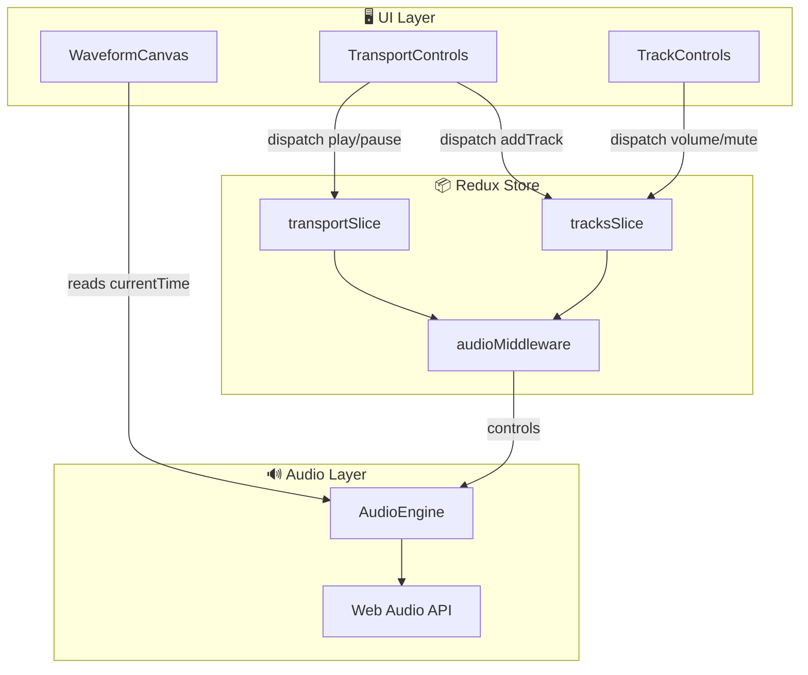
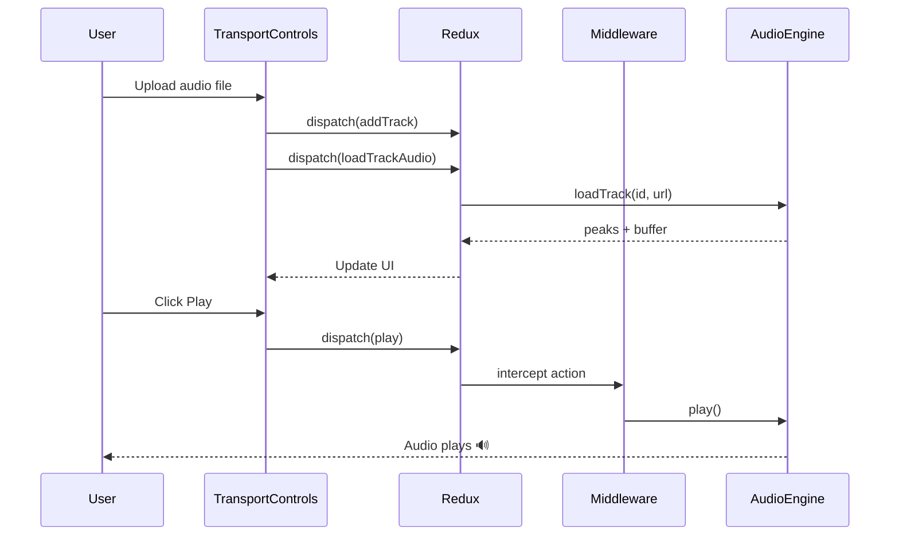

# 🎧 AudioPad

A browser-based multi-track audio editor built with React, TypeScript, and the Web Audio API.

**[🔗 Live Demo](https://audio-pad.netlify.app/)**

  

---

## ✨ Features

- **Multi-track audio editing** - Upload and manage multiple audio tracks
- **Waveform visualization** - Real-time 60fps canvas rendering
- **Track controls** - Volume, Mute (M), Solo (S) per track
- **Click-to-seek** - Click anywhere on the timeline to jump to that position
- **Album art extraction** - Automatically extracts and displays embedded album art
- **Keyboard shortcuts** - Space (play/pause), Esc (stop)
- **Exclusive solo mode** - Only one track can be solo'd at a time

---

## 🏗️ Architecture



### Data Flow



---

## 🛠️ Tech Stack

| Layer | Technology |
|-------|------------|
| **UI** | React 18, TypeScript |
| **State** | Redux Toolkit |
| **Audio** | Web Audio API |
| **Visualization** | Canvas API |
| **Metadata** | music-metadata-browser |
| **Build** | Vite |
| **Deploy** | Netlify |

---

## 🚀 Getting Started

```bash
# Clone
git clone https://github.com/SibilSoren/audiopad.git
cd audiopad

# Install
npm install

# Dev
npm run dev

# Build
npm run build
```

---

## 📁 Project Structure

```
src/
├── audio/
│   ├── AudioEngine.ts      # Singleton audio playback engine
│   └── AudioUtils.ts       # Buffer loading, peak extraction
├── components/
│   ├── TransportControls   # Header with play/pause/stop
│   ├── TrackControls       # Left panel track row
│   ├── WaveformCanvas      # Shared timeline canvas
│   └── HelpDialog          # Info modal
├── store/
│   ├── store.ts            # Redux store config
│   ├── transportSlice.ts   # Playback state
│   ├── tracksSlice.ts      # Track data + thunks
│   └── middleware/
│       └── audioMiddleware # Bridges Redux ↔ AudioEngine
└── styles/
    └── global.scss         # All styles (dark theme)
```

---

## ⌨️ Keyboard Shortcuts

| Key | Action |
|-----|--------|
| `Space` | Play / Pause |
| `Esc` | Stop |

---

## 📄 License

MIT
