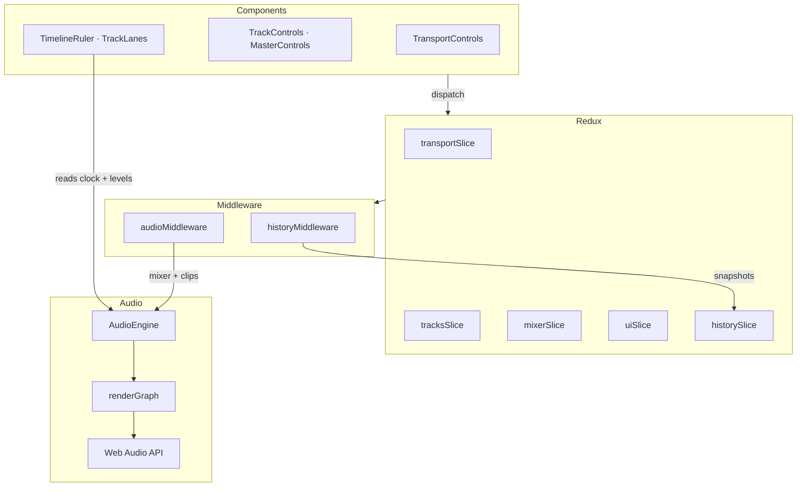

# AudioPad

A multi-track audio editor that runs entirely in the browser. Drop audio files in,
balance them, cut them up, and render the result to a WAV.

**[Try it →](https://audio-pad.netlify.app/)**

<!--
  Record docs/demo.gif and uncomment the line below. See docs/RECORDING.md.
  Left commented deliberately: a broken image is worse than none, and this
  README previously shipped one.


-->

No accounts, no uploads, no server. Files are decoded locally and never leave the machine.

---

## What it does

- **Drop files anywhere** — several at once
- **Mix** — per-track fader, mute and exclusive solo, with a master bus behind a limiter
- **Meter** — segmented level meters per track and on the master, post-fader
- **Edit** — drag clips to move them, drag their edges to trim, drag the top corners
  to set fades, split at the playhead
- **Navigate** — zoom anchored on the pointer, scroll, and a timeline that
  scales to the material
- **Undo** — the whole editing history, one entry per gesture
- **Export** — render the mix offline to a 16-bit WAV

---

## The interesting parts

### The audio engine lives outside React

The Web Audio API is imperative and React is declarative, so the problem is keeping
them apart. The engine is a singleton that owns the graph and the transport clock,
and a Redux middleware translates actions into engine calls. Nothing in the audio
path re-renders, and the transport clock is read directly from the engine rather
than round-tripping through the store sixty times a second.

### Volume and mute are separate gain stages

```
clip source → clip gain (fades) → track volume → track mute → master → limiter → out
```

Sharing one gain node between the fader and the mute means unmuting has to guess
what the level was. Two stages make that class of bug impossible: neither control
can overwrite the other, and solo is resolved as a mute rather than by writing to
faders.

### Clips are windows onto shared buffers

A clip is `{ sourceId, start, offset, duration }` — where it sits on the timeline,
and which part of the decoded audio it plays. Splitting one is arithmetic:

```
split C at t:
  left  = { ...C, duration: t - C.start }
  right = { ...C, start: t, offset: C.offset + (t - C.start), duration: ... }
```

Both halves point at the same `AudioBuffer`. No audio is copied and nothing is
re-decoded, which is what makes trimming and dragging cheap enough to run on every
pointer move.

### One graph builder, two destinations

Live playback and offline rendering call the same function. An exported file is
produced by the code that produced what you heard, rather than by a second
implementation kept in step by hand.

### The timeline draws the viewport, not the arrangement

The canvas stays viewport-sized and only the visible window is drawn — clips outside
it are skipped, and only the peaks under visible pixels are walked. Cost tracks the
size of the view rather than the length of the audio. A canvas wide enough to hold a
zoomed-in arrangement would hit the browser's dimension limit long before it ran out
of audio.

---

## Architecture


```mermaid
flowchart TB
    subgraph UI["Components"]
        T[TransportControls]
        S[TrackControls · MasterControls]
        C[TimelineRuler · TrackLanes]
    end

    subgraph Store["Redux"]
        TR[transportSlice]
        TK[tracksSlice]
        MX[mixerSlice]
        UIS[uiSlice]
        H[historySlice]
    end

    subgraph MW["Middleware"]
        HM[historyMiddleware]
        AM[audioMiddleware]
    end

    subgraph Audio["Audio"]
        E[AudioEngine]
        RG[renderGraph]
        WA[Web Audio API]
    end

    UI -->|dispatch| Store
    Store --> MW
    HM -->|snapshots| H
    AM -->|mixer + clips| E
    E --> RG
    RG --> WA
    C -->|reads clock + levels| E
```

Pure logic is kept out of both React and the engine so it can be tested on its own:

| Module | Responsibility |
|---|---|
| `audio/mixing` | mute, solo and volume resolution |
| `audio/scheduling` | which clips to schedule, and from where |
| `audio/clipOps` | split, move, trim, fade |
| `audio/levels` | RMS, peak, and the decibel mapping meters use |
| `audio/peaks` | waveform extraction |
| `audio/wav` | RIFF encoding |
| `lib/viewport` | zoom, scroll and lane geometry |
| `lib/clipHit` | which part of a clip the pointer is over |

---

## Running it

```bash
npm install
npm run dev
```

| Script | |
|---|---|
| `npm run dev` | development server |
| `npm test` | test suite |
| `npm run lint` | ESLint |
| `npm run build` | typecheck and production build |

CI runs lint, tests and the build on every push.

---

## Keyboard

| | |
|---|---|
| `Space` | play / pause |
| `Esc` | stop and deselect |
| `S` | split the selected clip at the playhead |
| `Del` | remove the selected clip |
| `Cmd`/`Ctrl` + `Z` | undo (`Shift` to redo) |
| `←` `→` | scroll the timeline (`Shift` for a page) |
| `Home` / `End` | jump to either end |
| `Cmd`/`Ctrl` + scroll | zoom around the pointer |

---

## Built with

React 19 · TypeScript · Redux Toolkit · Web Audio API · Canvas · Vite · Vitest

## License

MIT
